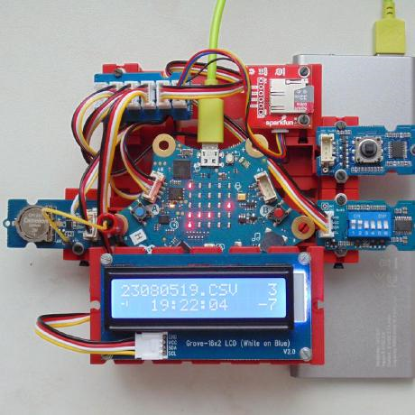

Diese Seite bei [https://calliope-net.github.io/i2c-uhr-speicherkarte-dipschalter-lcd/](https://calliope-net.github.io/i2c-uhr-speicherkarte-dipschalter-lcd/) öffnen.

### i2c Module an Calliope anstecken

* [Grove - 6-Position DIP Switch](https://wiki.seeedstudio.com/Grove-6-Position_DIP_Switch/) / [Grove - 5-Way Switch](https://wiki.seeedstudio.com/Grove-5-Way_Switch/)
* [Grove - 16x2 LCD](https://wiki.seeedstudio.com/Grove-16x2_LCD_Series/)
* [SparkFun Qwiic OpenLog](https://www.sparkfun.com/products/15164)
* [Grove - High Precision RTC (Real Time Clock)](https://wiki.seeedstudio.com/Grove_High_Precision_RTC/)

Kabel und Adapter

* [Grove - I2C Hub(6 Port)](https://wiki.seeedstudio.com/Grove-I2C-Hub-6Port/)
* [Qwiic Cable - Grove Adapter](https://www.sparkfun.com/products/15109)

Alle i2c Module werden parallel am linken Grove Steckverbinder A0 angeschlossen. 
Für die Stromversorgung sollte Calliope über USB Kabel (an Computer oder Powerbank) angeschlossen sein.

#### .hex-Datei direkt auf Calliope laden, oder in MakeCode importieren.

* [mini-i2c-uhr-speicherkarte-dipschalter-lcd.hex](mini-i2c-uhr-speicherkarte-dipschalter-lcd.hex)
* [Schnappschuss (Bildschirmfoto mit den Blöcken)](mini-i2c-uhr-speicherkarte-dipschalter-lcd.png)

#### Dieses Projekt von GitHub importieren, bearbeiten, mit Calliope testen.

Um dieses Repository in MakeCode zu importieren.

* öffne [https://makecode.calliope.cc](https://makecode.calliope.cc/)
* klicke auf **Importieren** und dann auf **Importiere URL**
* kopiere die folgende **URL des Projekts** in die Zwischenablage (Strg-C)
* **calliope-net/i2c-uhr-speicherkarte-dipschalter-lcd**
* füge sie auf der MakeCode Webseite ein (Strg-V) und klicke auf **Los geht's!**

### Bedienung der Calliope-App 'i2c-uhr-speicherkarte-dipschalter-lcd'

Mit dem DIP Schalter wird eingestellt:

* Schalter 1 OFF: LCD Display zeigt Datum und Uhrzeit an (dauerhaft jede Sekunde)
  * solange Knopf B gedrückt: zeigt den Zustand der 6 DIP Schalter binär am LCD Display an
* Schalter 1 ON: aller 10 Sekunden wird eine Zeile auf die Speicherkarte protokolliert
  * Dateiname ergibt sich aus Datum/Zeit yyMMddHH.CSV (pro Stunde eine neue Datei)
  * Inhalt der Zeile: Dateiname; Datum; Zeit; DIP-Schalter binär; Temperatur; DrehungX; DrehungY; HardwareInterrupt; RGB
  * aktueller Dateiname und Zeit (aller 10 Sekunden wenn Zeile geschrieben) wird auf LCD Display angezeigt
  * schreiben auf Speicherkarte kann zum Langzeit-Test der i2c Funktion genutzt werden
* Schalter 2 ON 3 OFF: LED-Matrix zeigt binär (in 5 Spalten) Uhrzeit (Stunde, Minute 10^1, Minute 10^0, Sekunde 10^1, Sekunde 10^0)
* Schalter 2 ON 3 ON: LED-Matrix zeigt binär Datum (Tag, -, Monat, -, Jahr)
* Schalter 2 OFF 3 ON: LED-Matrix löschen
* Schalter 4-5-6: Hintergrundfarbe r-g-b, wenn ein Display mit 'Backlight' angeschlossen ist (eine weitere i2c Adresse)

Einmalig Knopf A+B geklickt schaltet zusätzlich den Lagesensor (Drehung x- y-Achse) an (auch am i2c Bus).
Danach werden im Sekundentakt die x und y Winkel im LCD Display rechts angezeigt (und auf Speicherkarte protokolliert).

Der Sekundentakt kann von einer 'alle 1000 ms' Schleife kommen. Genauer geht es, wenn ein PIN mit CLK am RTC-Modul verdrahtet wird.
Das wird erkennt und schaltet die Schleife ab. Ein Symbol wird links unten angezeigt.

Auf dem LCD Display haben verschiedene Funktionen einen eigenen Bereich, ohne sich zu überschreiben.

### Erweiterungen

Die Calliope-App 'i2c-uhr-speicherkarte-dipschalter-lcd' lädt folgende Erweiterungen:

* [https://github.com/calliope-net/bit](https://calliope-net.github.io/bit/)
* [https://github.com/calliope-net/i2c](https://calliope-net.github.io/i2c/)
* [https://github.com/calliope-net/rtc-pcf85063tp](https://calliope-net.github.io/rtc-pcf85063tp/)
* [https://github.com/calliope-net/lcd-16x2rgb](https://calliope-net.github.io/lcd-16x2rgb/)
* [https://github.com/calliope-net/log-qwiicopenlog](https://calliope-net.github.io/log-qwiicopenlog/)
* [https://github.com/calliope-net/dip-switch](https://calliope-net.github.io/dip-switch/)

> [Upates für Erweiterungen; Erweiterungen aus einem Projekt löschen.](https://calliope-net.github.io/i2c-liste#updates)

> [Alle i2c-Erweiterungen für MakeCode von calliope-net (Software).](https://calliope-net.github.io/i2c-liste#erweiterungen)

#### Calliope-Apps, .hex-Dateien, Bildschirmfotos mit Blöcken

> [Alle Beispiel-Projekte für MakeCode von calliope-net (Calliope-Apps).](https://calliope-net.github.io/i2c-liste#programmierbeispiele)

> GitHub-Profil calliope-net: [https://github.com/calliope-net](https://github.com/calliope-net)

### Bezugsquellen

> [Alle i2c-Module und Bezugsquellen (Hardware).](https://calliope-net.github.io/i2c-liste#bezugsquellen)

#### Metadaten (verwendet für Suche, Rendering)

* Calliope mini
* i2c
